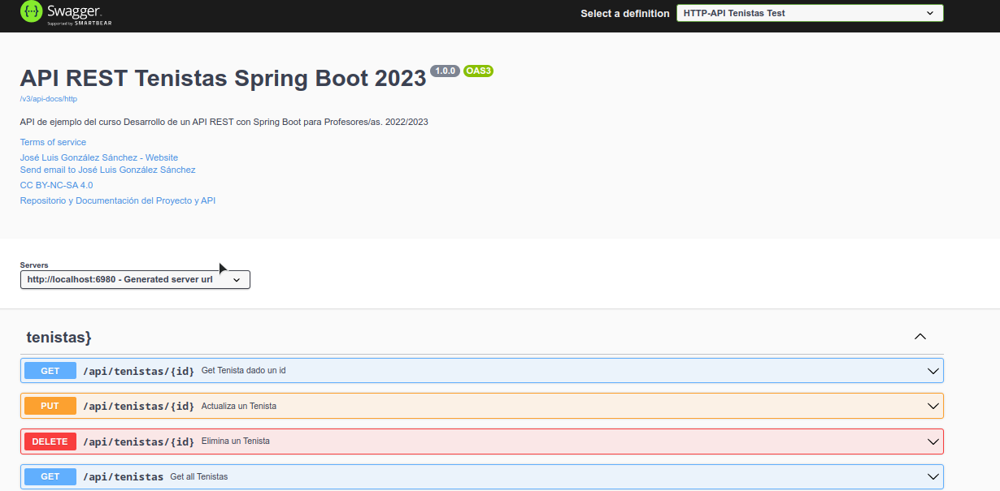

# Perfiles, Documentación y Despliegue


- [Perfiles, Documentación y Despliegue](#perfiles-documentación-y-despliegue)
  - [Perfiles de Spring Boot](#perfiles-de-spring-boot)
  - [Configuración de CORS](#configuración-de-cors)
  - [Documentación con Swagger y OpenAPI](#documentación-con-swagger-y-openapi)
    - [Documentando nuestros endpoints](#documentando-nuestros-endpoints)
  - [Desplegando nuestra aplicación](#desplegando-nuestra-aplicación)
    - [Creando un JAR](#creando-un-jar)
    - [Desplegando en Docker](#desplegando-en-docker)

## Perfiles de Spring Boot
Podemos definir perfiles de Spring Boot para que se ejecuten en función del entorno en el que se encuentre la aplicación. Por ejemplo, podemos tener un perfil para desarrollo y otro para producción. Para ello, debemos crear un fichero de propiedades para cada perfil, con el nombre `application-{nombre_perfil}.properties`. Por ejemplo, si tenemos un perfil de desarrollo, el fichero se llamará `application-dev.properties`. En este fichero, podemos definir las propiedades que queramos, que sobreescribirán a las definidas en el fichero `application.properties`. Para activar un perfil, debemos añadir la propiedad `spring.profiles.active={nombre_perfil}` en el fichero `application.properties`. Si no se define esta propiedad, se ejecutará el perfil por defecto, que es el que no tiene nombre.

De esta manera podemos tener distintos perfiles para distintos entornos, y que se ejecuten en función de la propiedad `spring.profiles.active`.

Por ejemplo, si tenemos el siguiente fichero `application.properties`:

```properties
# PERFIL GLOBAL
## Puerto de la aplicaci�n
# (si has activado https, es por defecto el del SSL)
# Tomamos el puerto de la variable de entorno PORT
server.port=${PORT:6983}
## INDICAMOS EL PERFIL ACTIVO
#Indicamos el perfil por defecto (Base de datos y otros)
# dev: developmet. application-dev.properties
# prod: production. application-prod.properties
spring.profiles.active=dev
```
Y el siguiente fichero `application-dev.properties`:

```properties
# PERFIL DE DESARROLLO
# Por ejemplo vamos a meter la base de datos
## Base de datos de desarrollo
# En fichero embebida o en memoria, t� eliges
# spring.datasource.url=jdbc:h2:./productosapirest
spring.datasource.url=jdbc:h2:mem:raquetas
# Usuario y contrase�a de la base de datos
spring.datasource.username=sa
#spring.datasource.password=password
# Habilitamos la consola de H2
http=//localhost:{server.port}/h2-console
# En nuestro caso http://localhost:69680/h2-console
spring.h2.console.enabled=true
# Habilitamos los mensajes sql en el log para ver las consultas
spring.jpa.show-sql=true
# Habilitamos que cargue los datos de prueba en la base de datos
# estos datos los carga del fichero data.sql del directorio resources
spring.jpa.defer-datasource-initialization=true
spring.jpa.hibernate.ddl-auto=create-drop
spring.sql.init.mode=always
spring.jpa.database-platform=org.hibernate.dialect.H2Dialect
```

Y tener el siguiente fichero `application-prod.properties`:

```properties
# PERFIL DE PRODUCCION
# Por ejemplo vamos a meter la base de datos
spring.datasource.url=jdbc:mysql://localhost:3306/raquetas
spring.datasource.username=root
spring.datasource.password=password
# Driver y opciones
spring.jpa.properties.hibernate.dialect=org.hibernate.dialect.MySQL5Dialect
spring.jpa.hibernate.ddl-auto=update
```

Podemos cambiar el perfil llamando a la aplicación con el parámetro `--spring.profiles.active={nombre_perfil}`. Por ejemplo, si queremos ejecutar el perfil de producción, ejecutaremos la aplicación de la siguiente manera:

```bash
java -jar productosapirest-0.0.1-SNAPSHOT.jar --spring.profiles.active=prod
```

## Configuración de CORS
Los navegadores web implementan una política de seguridad llamada [Same Origin Policy](https://developer.mozilla.org/es/docs/Web/Security/Same-origin_policy), que impide que una página web pueda acceder a recursos de otro dominio. Por ejemplo, si tenemos una página web en el dominio `https://www.midominio.com`, no podremos acceder a recursos de otro dominio, como por ejemplo `https://www.otrodominio.com`. Esto es así por seguridad, para evitar que una página web pueda acceder a recursos de otro dominio sin nuestro consentimiento.

```java
@Configuration
public class CorsConfig {
    /**
     * CORS: Configuración más ajustada.
     */
    @Bean
    public WebMvcConfigurer corsConfigurer() {
        return new WebMvcConfigurer() {

            @Override
            // Ajustamos una configuración específica para cada serie de métodos
            // Así por cada fuente podemos permitir lo que queremos
            // Por ejemplo ene esta configuración solo permitirmos el dominio producto
            // Permitimos solo un dominio
            // e indicamos los verbos que queremos usar
            // Debes probar con uncliente desde ese puerto
            public void addCorsMappings(CorsRegistry registry) {
                registry.addMapping("/rest/producto/**")
                        //.allowedOrigins("http://localhost:6980")
                        .allowedMethods("GET", "POST", "PUT", "DELETE")
                        .maxAge(3600);
            }

        };
    }
}
```

## Documentación con Swagger y OpenAPI
OpenAPI es una especificación para describir APIs REST. Swagger es una herramienta que nos permite generar documentación de APIs REST a partir de la especificación OpenAPI. Para ello, debemos añadir la dependencia de Swagger en nuestro proyecto:

```xml
<dependency>
    <groupId>org.springdoc</groupId>
    <artifactId>springdoc-openapi-starter-webmvc-ui</artifactId>
    <version>2.1.0</version>
</dependency>
```

El primer paso es configurar Swagger en nuestra aplicación. Para ello, debemos crear una clase de configuración, añadirle los metadatos de Swagger e indicar los endpoints que queremos documentar. Por ejemplo:

```java
@Configuration
class SwaggerConfig {
    @Bean
    OpenAPI apiInfo() {
        return new OpenAPI()
                .info(
                        new Info()
                                .title("API REST Tenistas Spring Boot 2023")
                                .version("1.0.0")
                                .description("API de ejemplo del curso Desarrollo de un API REST con Spring Boot para Profesores/as. 2022/2023")
                                .termsOfService("https://joseluisgs.dev/docs/license/")
                                .license(
                                        new License()
                                                .name("CC BY-NC-SA 4.0")
                                                .url("https://joseluisgs.dev/docs/license/")
                                )
                                .contact(
                                        new Contact()
                                                .name("José Luis González Sánchez")
                                                .email("joseluis.gonzales@iesluisvives.org")
                                                .url("https://joseluisgs.dev")
                                )

                )
                .externalDocs(
                        new ExternalDocumentation()
                                .description("Repositorio y Documentación del Proyecto y API")
                                .url("https://github.com/joseluisgs/tenistas-rest-springboot-2022-2023")
                );
    }


    @Bean
    GroupedOpenApi httpApi() {
        return GroupedOpenApi.builder()
                .group("http")
                //.pathsToMatch("/api/**") // Todas las rutas
                .pathsToMatch("/api/tenistas/**") 
                //.pathsToMatch("/api/test/**")
                .displayName("HTTP-API Tenistas Test")
                .build();
    }
}
```

Finalmente podemos acceder a la ruta en: http://localhost:XXXX/swagger-ui/index.html (XXXX es el puerto de nuestra aplicación). Por ejemplo: http://localhost:6980/swagger-ui/index.html

***NOTA***: No olvides abrir el endpoint de Swagger en el fichero de configuración de Spring Security.


### Documentando nuestros endpoints
Para ello usaremos las anotaciones
- `@Operation`: Para documentar un método
- `@Parameter`: Para documentar un parámetro
- `@RequestBody`: Para documentar el cuerpo de una petición
- `@ApiResponse`: Para documentar una respuesta

Un ejemplo de documentación de un método:

```java
@Operation(summary = "Actualiza un Tenista", description = "Actualiza un Tenista dado su id", tags = {"tenistas}"})
@Parameter(name = "id", description = "ID del Tenista", required = true, example = "1")
@ApiResponse(responseCode = "200", description = "Tenista actualizado")
@ApiResponse(responseCode = "404", description = "Tenista no encontrado")
@ApiResponse(responseCode = "400", description = "Tenista no válido")
@PutMapping("/{id}")
public ResponseEntity<TenistaResponseDto> putTenista(
        @PathVariable Long id,
        @Valid @RequestBody TenistaRequestDto tenista
) {
    log.info("putTenista");
    return ResponseEntity.ok(
            tenistaMapper.toResponse(tenistasService.update(id, tenistaMapper.toModel(tenista)))
    );
}
```

Finalmente entrando en la ruta de Swagger podemos ver la documentación de nuestros endpoints.



## Desplegando nuestra aplicación

### Creando un JAR
Para crear un JAR de nuestra aplicación, debemos ejecutar el comando de Maven:

```bash
mvn clean package
```

Te recuerdo que estos comandos los puedes ejecutar desde el propio IDE, en la pestaña de Maven. Además pasan los test, y si no quieres que los ejecute, puedes usar el comando `mvn clean package -DskipTests`.

Si quieres crear un deploy de tu aplicación basado en un perfil, puedes usar el comando `mvn clean package -DskipTests -Pprod`. Esto creará un JAR en la carpeta `target` de tu proyecto.

```bash
mvn clean package -DskipTests -Pprod 
```

Ejecutamos el JAR:

```bash
java -jar productosapirest-0.0.1-SNAPSHOT.jar
```

### Desplegando en Docker
Podemos crear un contenedor Docker de nuevo usando Maven: `mvn spring-boot:build-image`. De nuevo pasan los test y si no quieres que los ejecute, puedes usar el comando `mvn spring-boot:build-image -DskipTests`.

```bash
mvn spring-boot:build-image -DskipTests
```

Si todo va bien tendremos el mesanje `BUILD SUCCESS` y podremos ver la imagen creada con el comando `docker images`.

```bash
[INFO] Successfully built image 'docker.io/library/tenistas-profesores:0.0.1-SNAPSHOT'
[INFO] 
[INFO] ------------------------------------------------------------------------
[INFO] BUILD SUCCESS
[INFO] ------------------------------------------------------------------------
[INFO] Total time:  02:43 min
[INFO] Finished at: 2023-05-08T13:49:31+02:00
[INFO] ------------------------------------------------------------------------
```

Usando docker images podemos ver la imagen creada:

```bash
docker images
```

```bash
REPOSITORY                 TAG              IMAGE ID       CREATED        SIZE
paketobuildpacks/run       base-cnb         dd974fc40e68   7 days ago     90.6MB
paketobuildpacks/builder   base             7f032baea455   43 years ago   1.37GB
tenistas-profesores        0.0.1-SNAPSHOT   5a4d54b4e8c1   43 years ago   319MB
```

Ahora podemos ejecutar el contenedor con el comando `docker run -p 6980:6980 tenistas-profesores:0.0.1-SNAPSHOT`. Si todo va bien, podremos acceder a nuestra aplicación en http://localhost:6980/api/tenistas.

```bash
docker run -p 6980:6980 tenistas-profesores:0.0.1-SNAPSHOT
```

Puedes consultar otras formas [aquí](https://medium.com/swlh/build-a-docker-image-using-maven-and-spring-boot-58147045a400).
